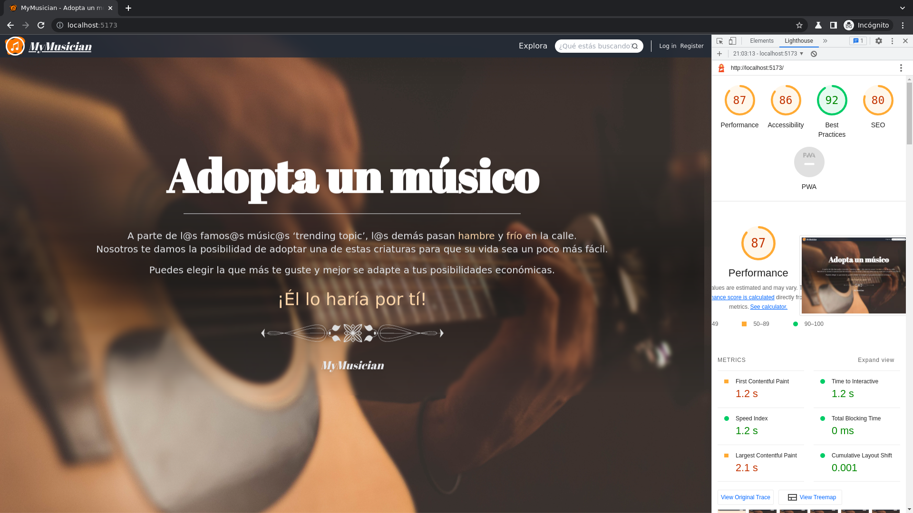

# MyMusician - WebApp amb Vuejs, Vite, Pinia, TypeScript i TailwindCSS

## Per Josep Maria Castell Colom

### Projecte per a Disseny d'Interfícies Web i Desenvolupament Web Entorn Client

---

## Descripció

Portal satíric basat en Verkami o Patreon per a esponsoritzar músics que no tenen feina.

L'usuari es pot registrar com a mecenes o com a músic.  
Com a mecenes pot cercar músics per a donar-lis una ajuda, periòdica o puntual, i, com a músic, pot crear un perfil per a intenar rebre ajudes dels mecenes.

En el prototip només és possible registrar-se com a mecenes.

---

## Resum d'especificacions tècniques generals

La pràctica es realitza amb el framework Vue + Vite. També s'utilitza Pinia per a la gestió d'estats i TailwindCSS com a llibrería de CSS.

S'ha implementat des de zero i només amb l'ajuda de TailwindCSS i Vue un menú d'hamburguesa i un carrusel de targetes de creació pròpia amb la seva lògica de funcionament escrita en TypeScript.

A la vista 'explora', s'han implementat una sèrie de filtres per a cercar el músic ideal.  
Aquests filtres són:

- Nom
- Instrument
- Edat
- Rol
- Sexe // TODO
- Quantitat de patrons // TODO

També s'ha implementat un sistema de registre i autenticació d'usuari molt senzill fent ús de Pinia i del '_localStorage_'.

---

## Especificacions tècniques concretes, rúbrica i on trobar cada apartat

- Vue 3

  - MINIM: S'ha utilitzat l'estructura bàsica de Vue amb Vue Router i s'han realitzat 6 vistes diferents.
  - COMP: S'han utilitzat diversos components per a modularitzar l'aplicació; es poden trobar a `src/components`.

- TailwindCSS

  - VERS: S'ha utilitzat l'última versió de TailwindCSS.
  - OBLIG: Components creats: CardVue, CardsCarousel, HorizontalCard, LightButton, DarkButton, MainHeader (NAVBAR), MainFooter i StickyNavbar (NAVBAR).
  - CUSTO: S'han utilitzat classes personalitzades de TailwindCSS com per exemple `max-w-[]`; on dins els claudàtors ('[]') s'hi estableix la mesura desitjada en cualsevol unitat vàlida de CSS (px, %, rem, em, etc.).
  - UTILI: TailwindCSS s'utilitza constantment amb '_utility classes_' per a definir els estils com per exemple `mt-` ('_margin-top_'), `py-` ('_padding-top + padding-bottom_'), `border-solid` ('_border: solid_')...
  - RESP: Per a mantenir la interfície "responsiva" s'han utilitzat els '_breakpoints_' de TailwindCSS.

- Multimedia & Design

  - IMAG: S'ha intentat cuidar el disseny de les diferents vistes per a que les imatges es mostrin correctament proporcionades en tot moment. Per exemple, a la HomeView s'ha creat una funció per a reconèixer el tamany de la pantalla del dispositiu i depenent d'aquest es mostra una imatge d'unes dimensions majors o menors.
    Les imatges han estat editades per a tenir la proporció correcta desitjada i s'han descarregat dues versions ([Unsplash](www.unsplash.com)) de cada una d'elles per tal de tenir la versió mitjana (`md`) i petita (`sm`). S'han optimitzat les 24 imatges utilitzades.
  - CARO: Dins el carrusel s'utilitzen 6 imatges correctament proporcionades.
  - PALET: La paleta de colors utilitzada es composa d'un color primari i un color secundari amb algunes variacions de lluminositat de cada un d'ells.
    Color principal: rgb(234 88 12)  
    Color principal V1(obscur): rgb(154 52 18)  
    Color principal V2(clar): rgb(255 237 213)  
    Color secundari: rgb(243 244 246)  
    Color secundari V2(clar): rgb(209 213 219)  
    Color negre  
    Color blanc
  - UX/UI: S'han seguit generalment els criteris de UX i UI vists anteriorment a classe.

- Documentation

  - DOCU: La documentació s'ha fet al README del repositori.
  - LIGHT: A la revisió de Lighthouse s'ha obtingut un 87 de '_performance_':
    

- Extensions / Ampliacions
  - PAGS: El mínim eren 4 pàgines i se n'han creat 6.
  - IMAPI: Ja que es disposa de totes les imatges no ha estat necessari l'ús de una API externa d'imatges.
  - DYNA: S'han utilitzat arrays dinàmiques amb l'objecte Ref per a poder modificar el contingut reactivament.
  - COOK: Per a la gestió d'usuaris s'ha emprat `localStorage` en lloc d'utilitzar `cookies`.
